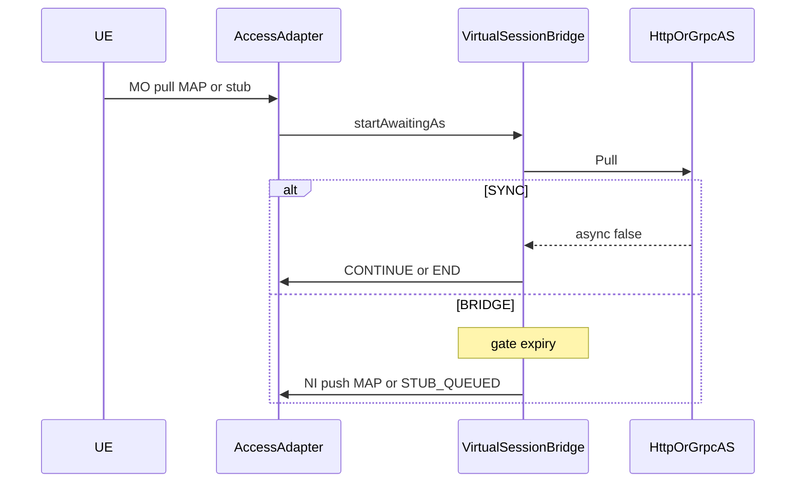

# AGENTS.md — RestLink USSD GW (ussdgw-jainslee)

**JDK: Java 25 only** (mise `zulu-25`). Quarkus 3.37.3 + micro-jainslee + `adapter-quarkus`.

## Mission
Greenfield RestLink USSD gateway that **replaces** classic WildFly [`ussdgateway`](../../../ussdgateway).
Behavior oracle = classic (adaptive timeout, Virtual Session Bridge, HTTP/gRPC pull+callback).
Wire contracts = **new** (JSON + proto). Access: **MAP live** in app; Diameter/SIP **RAs live in micro-jainslee** (`ra-diameter`, `ra-sip-servlet`) — app only has session adapters + feature flags.

## Dist
Ship only `dist/` → `RestLink/Ussdgw`. `./build/package-dist.sh` then `dist/run.sh`.
Bare-server bootstrap (OTA parity): [`dist-package-script.sh`](dist-package-script.sh) —
clone `restlink` (fallback `nhanth87`) → sctp → jss7 → jain-slee → `package-dist.sh`.
UI under `app/html/` only — never jars in `app/`.
Lab AS sims: `tools/as-http-sim.py`, `tools/as-grpc-json-sim.py`.

## Hard rules
- Log4j2 ONLY (`ussd.log.dir`); SleeEventTrace for SLEE boundaries — no dual LOG.info
- Link UP = SCTP+M3UA ACTIVE peer truth (`LinkStatusService`)
- Catch `Throwable` in every SBB `onEvent`; end/cancel MAP dialogs
- HTTP + gRPC use **RA callbacks** — never 50ms timer poll for responses
- Commits: nhanth87 / Tran Nhan only — no AI co-author trailers
- TENANT admin login: **username === tenantId** (RestLink is dist brand only)

## Stack
- MAP MO/NI via `ra-jss7` + [`MapUssdAccessAdapter`](src/main/java/et/restlink/ussdgw/access/MapUssdAccessAdapter.java)
- Diameter / SIP: **do not implement RAs here** — use micro-jainslee `ra-diameter` / `ra-sip-servlet` (Monitor Hub). App keeps thin [`DiameterUssdAccessAdapter`](src/main/java/et/restlink/ussdgw/access/DiameterUssdAccessAdapter.java) / [`SipUssiAccessAdapter`](src/main/java/et/restlink/ussdgw/access/SipUssiAccessAdapter.java) only.
- Access stubs → [`AccessNiDispatcher`](src/main/java/et/restlink/ussdgw/access/AccessNiDispatcher.java) (`OriginationType`)
- AS pull: `ra-http-client` (`JsonPostRequest` = raw POST body + `HttpCallbackCompletedEvent`)
  + `ra-grpc-client`. Do **not** use `CallbackRequest` for pull (that wraps
  `sessionId/status/payload` envelope).
- AS callback / admin: `ra-http-server` + `ra-grpc-server`
- Local ESME: **in-tree SMPP RA** (`et.restlink.ussdgw.ra.smpp`) — intentional local RA (not moved to micro-jainslee); optional USSD-over-SMPP stub (`ussd.smpp.ussd.enabled`)
- Alphabets: **AS-driven** via HTTP `AsResponse.alphabet` (`ucs7`|`ucs8`|`unicode`|`auto`) or SMPP `data_coding` → MAP CBS `0x0F` / `0x44` / `0x48`. GW does not hardcode. AUTO only when AS omits coding.
- Adaptive gate: classic EWMA + `effectiveGateMs(asyncGate, dialogTimeout)` (`ussd.dialog-timeout-ms=60000`)
- In-flight USSD saga: micro-jainslee **`ProfileFacility`** table `ussdTx` (`UssdTxProfile`, keyed by correlationId) — not ConcurrentHashMap-only

## Access PULL / PUSH (3GPP-shaped)

| Origination | PULL | PUSH (NI) | Where |
|-------------|------|-----------|-------|
| MAP | live | live (`NiPushRequestEvent`) | app + `ra-jss7` |
| DIAMETER | stub MO | STUB_QUEUED | RA = micro-jainslee `ra-diameter`; app adapter only |
| SMPP | stub MO | STUB_QUEUED | **local RA** in-tree + `ussd.smpp.ussd.enabled` |
| SIP | stub MO | STUB_QUEUED | RA = micro-jainslee `ra-sip-servlet`; app adapter only |
## AS modes (HTTP / gRPC)

| Mode | Pull | Ingress | MAP while waiting |
|------|------|---------|-------------------|
| **SYNC** | `AsResponse.async=false` | unused | dialog held; CONTINUE/END |
| **ASYNC_ACK** | `async=true` | `POST /as/callback` or gRPC Callback | dialog held until gate |
| **BRIDGE** | late / slow | same | gate → S1 release + NI push |

Operator toggles (admin Save → `ussd_config` KV overlay → Apply):
- `ussd.bridge.enabled`, `ussd.bridge.async-gate-timeout-ms`, `ussd.dialog-timeout-ms`
- `ussd.bridge.http-client-enabled` / `ussd.bridge.grpc-client-enabled` (per-leg bridge arm)
- `ussd.http.client.enabled` / `ussd.http.server.enabled` (+ timeouts, listen, callback path)
- `ussd.grpc.client.enabled` / `ussd.grpc.server.enabled` (+ invoke timeout, listen port)

Invariant: `1000 ≤ adaptiveGate ≤ asyncGateTimeoutMs < dialogTimeout`.
EWMA (`α=0.2`, headroom `1.5`, floor `1000ms`) per `networkId`. Feed only on
**content** AS replies (skip `async=true` ACK); callback ingress derives sample from
`pullStartedAtMs` when latency unknown. Invalid asyncGate → dialogTimeout (no EWMA).

## Admin HTTP

Auth: header `X-USSD-Admin-Key` or `?key=` (`ussd.admin.api-key`, default `ussd-admin`).
Shell: [`app/html/admin.html`](app/html/admin.html) → HTMX panels into `#panel`.
Planes: [`AdminPlaneHandler`](src/main/java/et/restlink/ussdgw/admin/AdminPlaneHandler.java)
Catalog: [`AdminCatalogHandler`](src/main/java/et/restlink/ussdgw/admin/AdminCatalogHandler.java)
Config overlay: [`RuntimeConfigStore`](src/main/java/et/restlink/ussdgw/config/RuntimeConfigStore.java) on `ussd_config`.

| Path | Purpose | Persist |
|------|---------|---------|
| `GET /admin/ss7` · `/admin/smpp` · `/admin/http` | **302** → Monitor Hub `?tab=` (OTA pattern) | — |
| `GET/POST /admin/ss7/config` | Quick jSS7 + MAP GT/SSN form | `ussd_config` + `ss7.json` + ra-jss7 |
| `GET/POST /admin/smpp/config` | Quick ESME/SMSC form | `ussd_config` + `smpp.json` + local SMPP RA |
| `GET/POST /admin/http/config` | Pull client + callback server + bridge | `ussd_config` + HTTP RAs |
| `GET/POST /admin/grpc` | Pull client + callback server + bridge flag | `ussd_config` + gRPC RAs |
| `GET/POST /admin/bridge` | Adaptive gate / dialog / wait messages / per-leg flags | `ussd_config` |
| `GET/POST /admin/routing` | Short-code → HTTP/gRPC AS URL; tenantId + networkId | `ussd_short_code` |
| `GET/POST /admin/campaigns` | NI push campaigns (MSISDN list + text) | `ussd_campaign` / target |
| `GET/POST /admin/tenants` | tenantId ↔ networkId, HTTP key, SMPP systemId/password | `ussd_tenant` |
| `GET/POST /admin/users` | ADMIN\|OPS\|TENANT (+ update) | `ussd_admin_user` |
| `/telemetry/` · `/api/ra/*` | **jainslee-monitor** hub (SS7/SMPP/HTTP packs; Save&Apply) | plane hooks |

SMPP RA admin pack: [`admin/smpp`](src/main/java/et/restlink/ussdgw/admin/smpp/) (local SPI, status truth = `anyPeerUp`).
SS7/HTTP packs come from micro-jainslee (`ra-jss7`, `http-server-ra`); hooks wired in `AdminHttpHandler.wireRaAdminHub()`.

### MAP addressing (TS 29.002)
Admin jSS7 form + props: `ussd.map.ussd-gt`, `ussd-ssn` (8), `hlr-ssn` (6), `msc-ssn` (8).
Wired into `SriSbb` / `MapDialogHelper.niPush` / session `localGt`.

### Tenant / networkId
- **tenantId** = logical customer id (not RestLink brand).
- **networkId** = MAP/CDR integer (`setNetworkId`). Rule inherits from tenant when `networkId=0`.
- **TENANT users:** login **username must equal tenantId** (enforced in `AdminUserService`).
- **Hot path:** [`TenantGuard`](src/main/java/et/restlink/ussdgw/tenant/TenantGuard.java) enforces
  `enabled` + `maxTps` (1s token window) on MAP MO and stub MO before `startAwaitingAs`.
  Blank `tenantId` on a rule = lab admit (no TPS). Bound tenant missing/disabled → MAP END reject.
- **AS callback:** `X-USSD-Api-Key` / `X-API-Key` must match tenant `httpApiKey` (or global
  `ussd.admin.api-key`) — [`CallbackAuthService`](src/main/java/et/restlink/ussdgw/tenant/CallbackAuthService.java).
- **Admin TENANT scope:** tenant HTTP key or Basic TENANT user → CDR + routing filtered to that
  tenantId; tenants/users/plane CRUD forbidden ([`AdminAuthService`](src/main/java/et/restlink/ussdgw/admin/AdminAuthService.java)).

### Saga / resilience
- In-flight states include `FAILED` (terminal, profile removed).
- [`UssdSagaCoordinator`](src/main/java/et/restlink/ussdgw/bridge/UssdSagaCoordinator.java):
  NI fail / AS pull fail → compensate (MAP abort or wait-END) + CDR `FAILED` + `store.remove`.
- [`BridgeGateScheduler`](src/main/java/et/restlink/ussdgw/service/BridgeGateScheduler.java):
  gate tick 0.2s + reclaim 30s; counters `gateExpired` / `reclaimCount` on `/admin/status`.
- [`AsPullClient`](src/main/java/et/restlink/ussdgw/service/AsPullClient.java): per-AS-URL circuit
  (open after N fails) + 1 retry on transport/5xx only; circuit open → early saga compensate
  (no hang until gate). Props: `ussd.as.pull.{fail-threshold,open-ms,max-retries}`.

### NI push campaigns
Tables `ussd_campaign` + `ussd_campaign_target` (V1). Admin: `/admin/campaigns` HTMX.
[`CampaignService`](src/main/java/et/restlink/ussdgw/campaign/CampaignService.java) create/start/pause/cancel;
[`CampaignScheduler`](src/main/java/et/restlink/ussdgw/campaign/CampaignScheduler.java) every **1s** claims
PENDING→SENDING (≤`ussd.campaign.claim-limit`, per-campaign `maxTps`) and routes
`NiPushRequestEvent` → SriSbb → MapNiPushSbb. Fail-closed if SS7 not live.
Busy-UE: skip MSISDN already `SENDING`. `correlationId` = target UUID; `onNiDone` from
MapNiPushSbb / SRI fail. Props: `ussd.campaign.{enabled,claim-limit,max-targets}`.
TENANT role may manage own tenant campaigns.

### Flyway
- Single `V1__ussdgw_baseline.sql` — short_code (+tenant/network), tenant (+smpp_password),
  admin_user, `ussd_cdr`, **campaign + campaign_target**, config.
- Wipe lab H2 / reset `flyway_schema_history` if an older V2–V4 history exists.

### CDR (OTA pattern)
File log logger `USSD_CDR` + DB via [`CdrDbFlusher`](src/main/java/et/restlink/ussdgw/cdr/CdrDbFlusher.java):
bounded queue + scheduled JDBC batch (hot MAP path never blocks on DB when `ussd.cdr.db.async=true`).
Lab: H2 `MODE=PostgreSQL`. Prod: set `quarkus.datasource.db-kind=postgresql` + JDBC URL.
Props: `ussd.cdr.enabled`, `ussd.cdr.network-id`, `ussd.cdr.db.{async,batch-size,queue-cap,flush-every}`.
Admin: `GET /admin/cdr` lists newest (`listRecords`, default 50 / max 100).

### In-flight saga (Profile)
Table `ussdTx` via micro-jainslee `ProfileFacility` — PK = correlationId.
Indexes: `requestId`, `dialogId`, `state`, `msisdn`. CAS via `compareAndSetField` on gate expiry.
Terminal states (`COMPLETED` / `ABORTED` / `FAILED` / `ZOMBIE`) remove the profile;
`ussd.tx.profile-ttl-ms` + 30s reaper reclaim orphans.
Generation bump **only** on MS input (`MapUssdParentSbb.onUserContinue`) — never on AS CONTINUE.
