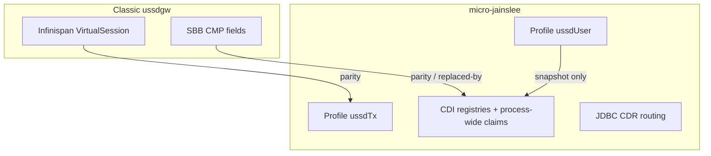

# CMP / Profile inventory + gaps — ussdgw-microjainslee

Research inventory (2026-08-10). **Doc-only** — no clustering design, no Digicom DB/config changes.

**Oracles:** this tree (`et.restlink.ussdgw.profile.*`, bridge, CDI registries) vs classic WildFly [`ussdgateway/master/core`](../../../../ussdgateway/master/core) `slee/sbbs/.../META-INF/sbb-jar.xml` + Infinispan VirtualSession. Parity overview: [`parity-matrix.md`](../parity-matrix.md). Footguns: [`lessons.md`](lessons.md). Identity law: [`map2map.md`](../as-contract/map2map.md) § ussdUser.

---

## A. ProfileFacility tables

| Table | Class | PK | Writers | Never |
|-------|--------|-----|---------|--------|
| `ussdTx` | [`UssdTxProfile`](../../src/main/java/et/restlink/ussdgw/profile/UssdTxProfile.java) + [`UssdTxProfileMapper`](../../src/main/java/et/restlink/ussdgw/profile/UssdTxProfileMapper.java) via [`VirtualSessionStore`](../../src/main/java/et/restlink/ussdgw/bridge/VirtualSessionStore.java) | `correlationId` | MO/NI/bridge CAS; single-field `updateField` / `setDialogAlive` | Reuse corr across MSISDNs; full `put` after CAS (rewrites all fields) |
| `ussdUser` | [`UssdUserProfile`](../../src/main/java/et/restlink/ussdgw/profile/UssdUserProfile.java) + [`UssdUserProfileStore`](../../src/main/java/et/restlink/ussdgw/profile/UssdUserProfileStore.java) | MSISDN digits | digit / CONTINUE / END / MAP2MAP arm+complete | AS resurrect via `lastCorrId`; per-GATE durable writes |

Both tables are **JVM-local** `InMemoryProfileFacility` until clustering (G1). Not Digicom JDBC.

### A.1 `ussdTx` fields

| Field | Type | Meaning | Write triggers |
|-------|------|---------|----------------|
| `correlationId` | String | PK / AS `localId` | Session create (`put`) |
| `virtualSessionId` | String | Internal VS id | `put` / mapper write |
| `requestId` | String | Ingress request id | create |
| `msisdn` | String | Bound subscriber (digits-normalized compare) | create; CAS-bound (`ensureMsisdnBound`) |
| `networkId` | Integer | SCCP/tenant plane (lab=1 / live=0) | create from dialog/rule |
| `dialogId` | String | MAP dialog id | create / update |
| `shortCode` | String | Routed short code | create |
| `state` | String | `VirtualSessionState` name | CAS transitions (`claimForAsResponse`, gate, …) |
| `generation` | Integer | Menu gen; bumps **only** on MS digit | digit path; AS stamp matches this |
| `pendingText` | String | Text waiting for MAP out | bridge / AS response |
| `pendingAlphabet` | String | Alphabet enum name | AS response |
| `createdAtMs` | Long | Session create wall | create |
| `gateDeadlineMs` | Long | Adaptive gate absolute deadline | arm gate |
| `gateMs` | Long | Budget used for this park | arm gate |
| `pullStartedAtMs` | Long | AS pull start (wall) | pull start |
| `pullStartedAtNanos` | Long | AS pull start (nanos) | pull start |
| `invokeId` | Long | Last MAP invoke id | continue / MO |
| `dialogAlive` | Boolean | MAP dialog still open | `setDialogAlive` (single-field — never full put after) |
| `adaptiveBridgeArm` | Boolean | Bridge/adaptive armed | arm paths |
| `map2mapHopOutstanding` | Boolean | Case 2 hop open — MO hold | MAP2MAP arm / clear |
| `mscGt` / `imsi` / `localGt` | String | NI / SRI routing | SRI / NI paths |
| `tenantId` | String | Tenant | create |
| `originationType` | String | `OriginationType` name | create |
| `originatedUssd` | String | Full MO dialed (survives digit pulls) | MO create |
| `redirectUssd` | String | MAP2MAP redirect string | MAP2MAP arm |
| `hopUssd` | String | Hop USSD text toward AS | hop complete |
| `expiresAtMs` | Long | TTL reclaim ceiling | `put` |

**CAS / single-field law:** after `compareAndSetField`, never `get()`+full `UssdTxProfileMapper.write`/`put` — that republishes every field and can resurrect concurrent updates (e.g. `dialogAlive`). Prefer `VirtualSessionStore.setDialogAlive` / `ProfileFacility.updateField`.

### A.2 `ussdUser` fields

| Field | Type | Meaning | Write triggers |
|-------|------|---------|----------------|
| `msisdn` | String | PK (digits-normalized) | first stamp |
| `lastCorrId` | String | Last corr **snapshot only** | `recordMap2Map` / menu |
| `lastShortCode` / `lastRedirectUssd` | String | Last rule + redirect | `recordMap2Map` |
| `lastHopDestGt` / `lastHopDestSsn` | String / Integer | Last hop CalledParty | `recordMap2Map` |
| `lastHopOutcome` | String | `pending` \| `text` \| `reject` \| `abort` \| `empty` \| … | arm=`pending`; terminal outcomes bump count |
| `lastGateMs` / `lastEwmaMs` | Long | Last AdaptiveTimeout budget + observed EWMA | MAP2MAP / complete |
| `lastUpdatedAtMs` | Long | Wall of last stamp | any write |
| `map2mapTxCount` | Integer | Terminal hop outcomes (not `pending`) | terminal `recordMap2Map` |
| `networkId` / `tenantId` | Integer / String | Last plane / tenant | stamp |
| `lastGeneration` | Integer | Last multimenu gen | `recordMenuState` |
| `lastDigit` | String | Last MS digit | digit (after dup-skip) |
| `lastMenuAsUssd` | String | AS→UE menu snip ≤50 | CONTINUE/END |
| `lastAsAction` | String | CONTINUE / END / ABORT / pending | menu / digit |
| `lastDialogId` | String | Ops dialog id | menu |

**Writers:**

| API | When |
|-----|------|
| `recordMap2Map` | Hop arm (`pending`); hop complete (`Map2MapCompletionService`); Parent hop-arm |
| `recordMenuState` | Parent after MS digit (post dup-skip); Bridge on AS CONTINUE/END |

**MO:** seed AdaptiveTimeout from `lastEwmaMs` only — **never** reuse `lastCorrId` as AS/`localId`.

---

## B. Classic SBB CMP → micro replacement

Source: classic `core/slee/sbbs/src/main/resources/META-INF/sbb-jar.xml`. Micro SBBs have **no** `sbb-jar.xml` CMP — pool + activity-context entity id make instance fields non-correlating ([lessons](lessons.md)).

### B.1 Parent / pull clients (MO → AS)

| Classic SBB | CMP field | Micro home |
|-------------|-----------|------------|
| ParentSbb | `dialog` | MAP dialog handle on event + `ussdTx.dialogId` / `dialogAlive` |
| HttpClientSbb / GrpcClientSbb / SipSbb | `call` | RA activity / event payload (not Profile) |
| same | `xmlMAPDialog` | Encoded body on pull event / wire codecs; park state on `ussdTx` + NI park |
| same | `processUnstructuredSSRequestInvokeId` | `ussdTx.invokeId` |
| same | `timerID` | AdaptiveTimeout + `BridgeGateScheduler` / RA timers (not SBB CMP) |
| same | `userObject` | Correlation carried on events + `ussdTx` |
| same | `finalMessageSent` | Bridge / Parent end paths + state machine |
| same | `httpSessionId` | NI `JSESSIONID` / corr; `ClassicNiHttpPark` |
| same | `cdrState` | **`CdrService` / JDBC `ussd_cdr_session`** — not SBB CMP. Classic shared-local bug class → micro must not put CDR on pooled SBB fields; registry/CDI only |

### B.2 NI / server / SRI

| Classic SBB | CMP field | Micro home |
|-------------|-----------|------------|
| HttpServerSbb / GrpcServerSbb / SipServerSbb | `xmlMAPDialog` | NI decode → `ClassicNiIngress` / park; push dialog on `ussdTx` |
| Http/Grpc server | `eventContextCMP` | SLEE event context (ephemeral) |
| servers + SriSbb | `locationInfoCMP` / `imsiCMP` / `msisdnCMP` | `ussdTx.mscGt` / `imsi` / `msisdn`; `PendingSriRegistry` / HLR proxy registries by **corr** |
| servers + SriSbb | `maxMAPApplicationContextVersionCMP` / `mAPApplicationContextCMP` | MAP stack / dialog open params (RA), not Profile |
| servers + SriSbb | `ussdGwAddressCMP` / `ussdGwSCCPAddressCMP` | SS7 seed / stack config |
| servers | `timerID` / `finalMessageSent` | AdaptiveTimeout + park complete |
| SriSbb | `sendRoutingInfoForSMResponse` / `errorComponent` / `errorInvokeId` / `rejectProblem` / `rejectInvokeId` | `PendingSriRegistry` / Parent SRI handlers (corr-keyed); no `takeAny` |

### B.3 Classic Infinispan saga

| Classic | Micro |
|---------|--------|
| Infinispan `VirtualSessionStore` | ProfileFacility **`ussdTx`** (`UssdTxProfile`) |
| ChildSbb CMP dialog tree | `VirtualSessionBridge` + `ussdTx` state/generation |

---

## C. Heap / process-wide (not Profile CMP)

Identity-critical; **lost on restart** with Profile tables until clustering.

| Owner | Key | Role |
|-------|-----|------|
| `VirtualSessionStore.tryClaimMsDigitContinue` / `releaseMsDigitInFlight` | corr + invokeId | Process-wide digit claim — heap `AtomicLong` on `VirtualSession` **resets on ussdTx rehydrate** |
| `VirtualSessionStore.ensureMsisdnBound` / `assertSameMsisdn` | corr → MSISDN | Fail-closed bind; NI **409** on digits mismatch |
| `AsPullStateRegistry` | corr | AS pull in-flight (submit clock, retries, TTL, max 100k) — replaces classic child CMP + static `GRPC_SUBMIT_AT_MS` |
| `PendingSriRegistry` / `PendingHlrProxyRegistry` | corr | SRI / HLR proxy pending — never `takeAny` |
| `AdaptiveTimeout` EWMA | networkId (+ MSISDN seed) | Gate budget; MO may seed from `ussdUser.lastEwmaMs` |
| `ClassicNiHttpPark` | corr / cookie | Sync NI HTTP park under AdaptiveTimeout |
| `ProfileFieldStoreLocator` re-bind | process | `VirtualSessionStore.put` / `UssdUserProfileStore` must point locator at container facility + `ensureTable` |
| `ProfileAccessorInvoker` | classpath | **api stub UOE** vs **core** impl — `package-dist` must shadow core class into `jainslee-api` jar |

---

## D. Gap register

| ID | Gap | Severity | Status | Evidence |
|----|-----|----------|--------|----------|
| G1 | ProfileFacility JVM-local — restart/HA lose `ussdTx`/`ussdUser` + heap registries/EWMA | High (HA) | **Deferred** — no cluster impl this pass | Decision 2026-08-09; supermemory |
| G2 | Rehydrate resets VirtualSession heap atomics → dual digit AS pull | High (MO multimenu) | **Mitigated** process-wide claim | Digicom 2026-08-10; `tryClaimMsDigitContinue` |
| G3 | Quarkus loads api stub `ProfileAccessorInvoker`; wrong/empty `ProfileFieldStoreLocator` → NI 500 / `No profile table: ussdTx` | High (NI) | **Mitigated** package-dist shadow + put re-bind | [lessons](lessons.md) |
| G4 | Classic SBB CMP has no micro `sbb-jar` analog | Info | **By design** — CDI registries + `ussdTx` | §B |
| G5 | Full `put`/`UssdTxProfileMapper.write` after CAS can revert concurrent single-field writes | High if misused | **Mitigated** by convention (`setDialogAlive` / `updateField`) | [skills](skills.md) CAS law |
| G6 | `ussdUser.lastCorrId` misused as AS session resurrect | High if misused | **Law** — snapshot only | [map2map.md](../as-contract/map2map.md) |
| G7 | Per-GATE / per-tick durable profile or CDR expand writes | Perf (10k honesty) | **Law** — digit/CONTINUE/END only; fold `events_json` | AGENTS / lessons |
| G8 | Classic `cdrState` on pooled SBB instances | Bug class | **Avoided** — JDBC flusher / CdrService | memory CDRState; AsPullStateRegistry javadoc |
| G9 | Clustering / Infinispan write-behind for ProfileFacility | Future | **Gap only** — not designed here | G1 |

---

## Related docs

| Doc | Role |
|-----|------|
| [map2map.md § ussdUser](../as-contract/map2map.md) | Snapshot field meanings |
| [parity-matrix.md](../parity-matrix.md) | Classic vs micro feature map |
| [lessons.md](lessons.md) | ProfileAccessor, locator, digit claim, isolation |
| [skills.md](skills.md) | CAS ≠ full put; Digicom package shadow |
| micro-jainslee ProfileFacility (upstream) | Core facility / indexes / flushSync — domain CMP stays in apps |
