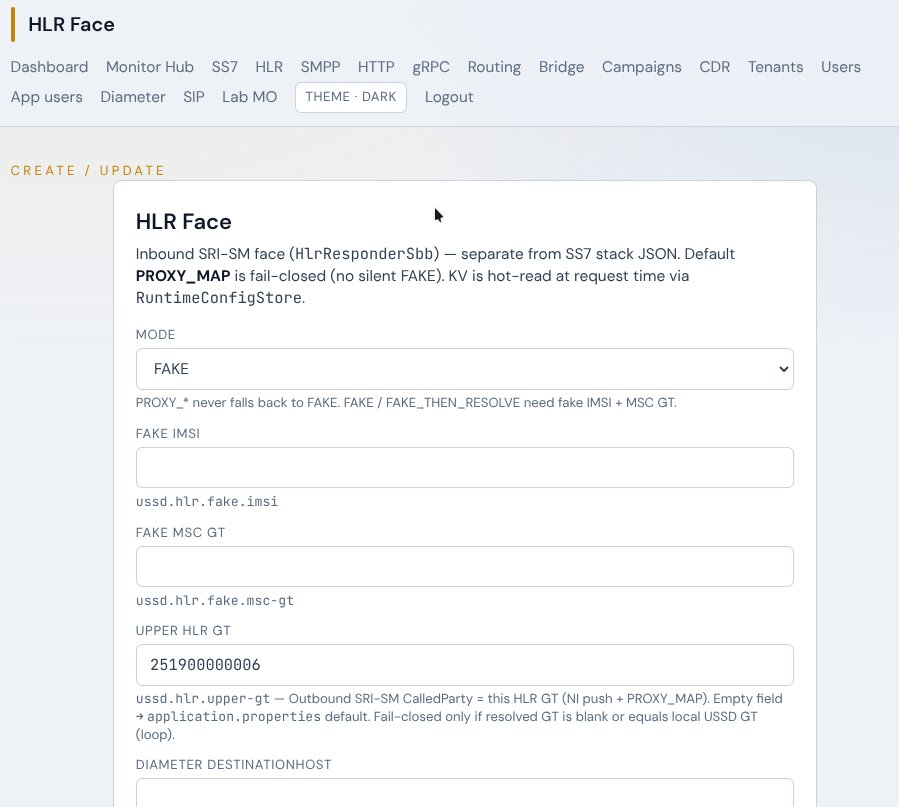
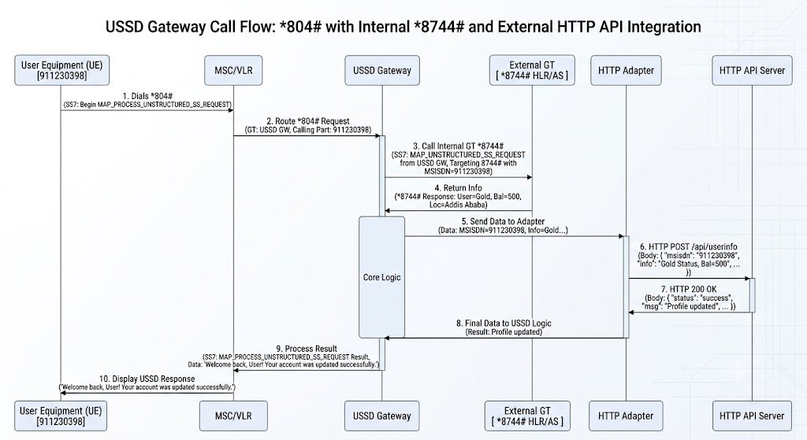

# MAP2MAP re-route — Case 2 (upper HLR USSD, no SRI)

Authoritative MO enrich path (routing-driven). **One unique short-code rule** covers both
exact short dials and long mark prefixes — no separate short/long rule types.

**Stay-on-call** during the long hop+AS path ≡ **AdaptiveTimeout + Virtual Session Bridge**
(armed at hop ingress). Not a separate app-user / profile column — ensure
`ussd.bridge.enabled=true` (default) and MAP2MAP Parent always `setAdaptiveBridgeArm(true)`.

```
UE *804#  (or mark *101 → *101123456#)
  → MSC → GW          MAP processUnstructuredSS-Request
  → MapUssdParentSbb  rule.map2mapArmed() (reroute_enable + redirect USSD)
                      **arm AdaptiveTimeout + startAwaitingAs** (AWAITING_AS + gate)
                      = stay-on-call while hop+AS run
  → Map2MapSbb         Case 2 hop (NO SRI / NO FAKE→MSC):
                        hop_dest_gt set → UnstructuredSS-Request → that GT/SSN
                        hop_dest blank → UnstructuredSS-Request → ussd.hlr.upper-gt
                                          (+ hop_dest_ssn or default SSN 6)
                        USSD string = redirect (e.g. *875#)
  → peer upper HLR    UnstructuredSS-Response (user info)
  → Map2MapCompletion  sync AS pull via AsPullRouter (HTTP|gRPC|SIP per rule_type):
                        ussdString=hop text; additive originatedUssd + shortCode + codeKind;
                        if still AWAITING_AS → **re-arm** gate for AS;
                        if already S1_RELEASED → keep bridged (no CAS reset)
  → AS (HttpClientSbb / GrpcClientSbb / Sip MESSAGE) 200 / OK
  → GW → MSC → UE     processUnstructuredSS result  (or NI late reconcile)
  (slow hop or AS)    BridgeGate → async-wait UE + GatedAsNotifyService encodeGatedPush XML
```

Case 1 HLR face **SRI** (`SriSbb` / NI push) is **unchanged** and separate from this path.






## Per-rule model (N rules)

Re-route is **not** tied to a single Digicom code. Each `ussd_short_code` row may independently set
`reroute_enable`, redirect USSD (`map2map_gt`), optional `hop_dest_gt`/`hop_dest_ssn`, `hlr_mode`
(ignored for Case 2 hop; used by NI / HLR face), `mark`, and `as_url`. Operators add/edit many
rules on `/admin/routing` (e.g. `*804#` → `*875#`).


There is **no** Java/UI special-case for `*875#` or any carrier GT — those values appear only as
**examples** in docs, placeholders, and optional lab seeds.

## Service-provider lab parameters (example prove only)

| Param | Example value | Role |
|-------|---------------|------|
| Redirect USSD (`map2map_gt`) | e.g. `*875#` | Outbound UnstructuredSS-Request **string** (any code) |
| Hop dest GT (`hop_dest_gt`) | e.g. `251971200201` | SCCP **CalledParty** GT when fixed peer (optional) |
| Hop dest SSN (`hop_dest_ssn`) | e.g. `6` | CalledParty SSN (default 6); alone with Re-route = SSN for upper-gt |
| MO dial (lab) | e.g. `*804#` or dedicated lab code | One example rule with `reroute_enable=true` |

When `hop_dest_gt` is set, hop → that GT/SSN. When **blank**, hop → HLR Face
`ussd.hlr.upper-gt` from `/admin/hlr` + SSN 6 (fail-closed if blank/self-loop).
**Never** SRI or FAKE→MSC on Case 2.

Admin form fields: `hopDestGt` / `hopDestSsn` (also accept `map2map_dest_gt` /
`map2map_dest_ssn` synonyms). Schema: Flyway **V11** (`hop_dest_gt`, `hop_dest_ssn`).

### Lab SQL (local / operator — do **not** silently mutate Digicom `*804#`)

Prefer a **dedicated lab rule** (or ask before touching live Digicom rows):

```sql
-- Lab/test rule example (adjust short_code / as_url for your env)
-- Blank hop_dest → upper-gt from HLR Face (Case 2 default)
INSERT INTO ussd_short_code
  (short_code, rule_type, as_url, enabled, tenant_id, network_id, mark, app_username,
   bypass, reroute_enable, map2map_gt, hlr_mode, hop_dest_gt, hop_dest_ssn)
VALUES
  ('*804#', 'HTTP', 'http://127.0.0.1:8090/ussd/pull', TRUE, NULL, 0, FALSE, '',
   FALSE, TRUE, '*875#', NULL, NULL, NULL)
ON CONFLICT DO NOTHING;

-- Or fixed peer GT (still no SRI):
-- hop_dest_gt = '251971200201', hop_dest_ssn = 6

-- Digicom operator (surgical, backup first) — ask before running on Digicom PG.
```

Full lab runbook: [`tools/map2map-lab/README.md`](../../tools/map2map-lab/README.md).

## Re-route flag (source of truth)

| `reroute_enable` | Behaviour |
|------------------|-----------|
| `false` (default) | Skip MAP2MAP — classic direct `asUrl` pull |
| `true` + non-blank redirect USSD (`map2map_gt`) | Arm Case 2 hop then AS |

`bypass` is kept as a DB mirror (`bypass = NOT reroute_enable`) for transition only — prefer `reroute_enable`.

## Routing fields (single rule model)

| Field | Example | Notes |
|-------|---------|-------|
| short_code | `*804#` or mark `*101` | Exact short when mark=false; mark prefix for long |
| mark | `true` / `false` | Prefix match; Ethiopia use `*101` not `*101*` |
| reroute_enable | `true` | Positive arm flag (Case 2) |
| map2map_gt | `*8744#` / `*875#` | **Redirect USSD string** on outbound Request (not SCCP GT) |
| hop_dest_gt | `251971200201` | Optional fixed SCCP CalledParty GT |
| hop_dest_ssn | `6` | Optional; default **6**; alone with Re-route = SSN for upper-gt |
| hlr_mode | `INHERIT` / … | **Ignored** for Case 2 hop; NI / HLR face Case 1 only |
| as_url | HTTP AS | Step after hop; also gated XML push target |
| network_id | tenant / SCCP | |

**Matching law (unchanged):** exact (mark=false) wins on equality; else longest enabled mark
prefix. One mark rule can cover both short and long (e.g. `*101` matches `*101#` and
`*101123456#`). Prefer mark prefix over inventing a second rule type.

## Hop dest matrix (Case 2)

| `hop_dest_gt` | Routing |
|---------------|---------|
| blank | `UnstructuredSS-Request` → **`ussd.hlr.upper-gt`** + SSN (`hop_dest_ssn` or 6); no IMSI; **no SRI** |
| set (e.g. `251971200201`) | Direct hop to that GT + `hop_dest_ssn` (default 6); USSD = redirect; **no IMSI**; **no SRI** |

Fail-closed: unusable/blank/self-loop upper GT when hop dest blank (`MAP2MAP_UPPER_GT_FAIL`);
blank hop GT digits when hop_dest set (`MAP2MAP_HOP_DEST_FAIL`).

## AS pull enrich (additive)

XML dialog attrs / JSON fields (classic AS may ignore unknowns):

| Field | Meaning |
|-------|---------|
| `msisdn` | Subscriber |
| `ussdString` / `string=` | Hop response text (or dialed when hop empty) |
| `originatedUssd` | Full UE dialed string |
| `shortCode` | Matched rule key |
| `codeKind` | `SHORT` \| `LONG` |

## Case 1 HLR Face SRI (not MAP2MAP)

Inbound SRI-SM / NI PROXY_MAP outbound SRI remain on `SriSbb` + `/admin/hlr`.
MAP2MAP Case 2 does **not** increment `map2map.hopSri` / `map2map.hopFake`.

## Bridge / AdaptiveTimeout / stay-on-call

Re-route **arms at hop ingress** (`MapUssdParentSbb` map2map branch):
`adaptiveBridgeArm=true` + `startAwaitingAs` → session `AWAITING_AS` with EWMA gate
deadline **before** outbound redirect USSD. That is stay-on-call: UE dialog is gated by
AdaptiveTimeout / Virtual Bridge, not hard TC-END at hop start.

| When gate fires | UE | AS |
|-----------------|----|----|
| During hop (before UnstructuredSS-Response) | `asyncWaitMessage` via `onGateExpired` (`AWAITING_AS → S1_RELEASED`) | `GatedAsNotifyService` / `encodeGatedPush` |
| During AS pull (after hop, still `AWAITING_AS`) | same | same |

Hop completion (`Map2MapCompletionService`):

- Still `AWAITING_AS` → re-arm for AS wait
- Already `S1_RELEASED` → do **not** `startAwaitingAs` again (CAS)

TTL: `max(ussd.map2map.pending-ttl-ms, dialogTimeoutMs)`; TTL after bridge does not
double `replyAndEnd` (`MAP2MAP_TIMEOUT_AFTER_BRIDGE`).

## Telemetry / CDR

| Key / status | Meaning |
|--------------|---------|
| `map2map.armed` | Rule armed MAP2MAP + bridge at hop ingress |
| `map2map.hopStarted` | Live hop started (SS7 up) |
| `map2map.hopFixedGt` / `hopUpperGt` | Explicit hop_dest vs upper-gt fallback |
| `map2map.hopFake` / `hopSri` | Legacy (Case 2 does not increment) |
| `map2map.hopOk` / `asRouted` | Hop complete + AS pull routed |
| `map2map.gatedDuringHop` | Adaptive gate fired while pending MAP2MAP still open |
| `MAP2MAP_ARMED` | Bridge + AdaptiveTimeout armed at hop ingress |
| `MAP2MAP_HOP_START` | Case 2 hop started (`path=fixed` or `path=upper-gt`) |
| `MAP2MAP_USSD_SENT` | Outbound UnstructuredSS toward hop GT |
| `MAP2MAP_GATED_HOP` | Gate fired during hop (also classic `GATED`/`BRIDGED`) |
| `MAP2MAP_OK` / `MAP2MAP_COMPLETE_AFTER_GATE` | Hop done → AS pull (re-arm vs already S1_RELEASED) |
| `MAP2MAP_TIMEOUT` / `MAP2MAP_TIMEOUT_AFTER_BRIDGE` | Hop TTL / REJECT / abort — still AS-pulls empty hop then (if AS route fails) hard-fail UE |
| `GATED` / `BRIDGED` / `GATE_EXPIRED` | AdaptiveTimeout / Virtual bridge / NI park |
| `GATED_AS_NOTIFY` / `GATED_AS_ACK` / `GATED_AS_FAIL` | Gated XmlMAPDialog POST to AS |

Detail pipe fields: `sc|redirect|dialed|hopGt|hopSsn|path|…`. Columns `gate_ms` / `observed_ewma_ms` via `CdrDbFlusher`. Admin filter: `/admin/cdr?status=MAP2MAP_*` or `GATED*`. Catalog: `CdrStatuses` + `Map2MapCdr`.

## Digicom note

`reroute_enable=true`, `map2map_gt='*875#'`, optional `hop_dest_*` or blank → upper-gt —
**ask before mutating** operator DB.
