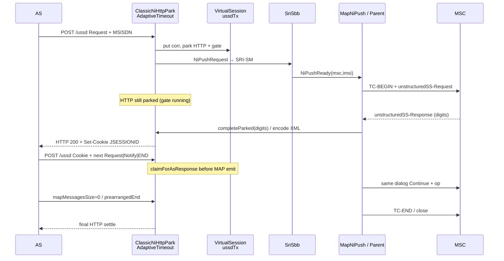

# USSD 3GPP reading notes + NI / bridge architecture

Durable notes after a full read of Stage 1 / Stage 2 / Circuit BS / MAP USSD ops.
**AdaptiveTimeout + VirtualSession / BRIDGE stay on top** of MAP NI — MAP completeness sits under that park/gate layer. Do not rip bridge/adaptive for “raw MAP only”.

Companion wire contract: [`classic-xml.md`](classic-xml.md). Agent compress: [`../agents/skills.md`](../agents/skills.md). Footguns: [`../agents/lessons.md`](../agents/lessons.md).

---

## Sources actually read (version / date)

| Spec | Version | How obtained | USSD relevance |
|------|---------|--------------|----------------|
| **3GPP TS 22.090** Stage 1 | **V18.0.1** (ETSI TS 122 090, **2024-05**) | ETSI deliver text extract | **Primary** Stage 1 |
| **3GPP TS 23.090** Stage 2 | **V18.0.0** (ETSI TS 123 090, **2024-05**) | ETSI deliver text extract | **Primary** Stage 2 flows / SDL |
| **3GPP TS 22.002** Circuit Bearer Services | **V17.0.0** (ETSI TS 122 002, **2022-04**) | ETSI deliver text extract | **Not USSD** — bearer services only |
| **3GPP TS 29.002** MAP | **V18.0.0** (ETSI TS 129 002, **2024-05**) | ETSI deliver text extract (USSD clauses + Table 7.3/2 + ASN.1 ops) | **Primary** MAP ops / AC / destRef |
| ARIB Rel-5 PDF mirrors | **22.090 V5.0.0** / **23.090 V5.0.0** (2002-06) | Local download `/tmp/3gpp-ussd-specs/` (cross-check; Rel-18 text used for citations) | Same Stage 1/2 substance for MMI NI/MO |
| Classic oracle | Chapter-HTTP + `HttpServerSbb` / `USSDBaseSbb` | `ussdgateway/master` | AS XML ↔ MAP mapping, park, timers |
| Greenfield | `ClassicNiHttpPark`, `VirtualSessionBridge`, `MapNiPushSbb` | this tree | Layering / gaps |

**Local tree search:** no checked-in full PDFs under `ethiopia-working-dir` for these four specs (only `.kilo/skills/3gpp-specs/SKILL.md` index). Classic docs cite USSD flows; prior lesson noted PDFs not re-read end-to-end — **this note supersedes that**.

**Grill on “22002”:** user wrote **22.002**. That TS is **Circuit Bearer Services** (BS 20/30, etc.) — **no USSD message set**. The MAP ops oracle used by classic Table **7.3/2** / Chapter-HTTP is **TS 29.002**. Both were read; implement against **29.002** for MAP.

---

## 1. Stage 1 — TS 22.090 (V18.0.1)

### Modes (§4)

- **MMI-mode:** transparent MMI strings UE↔network; text displayed to user.
- **Application mode:** transparent binary between network app and UE app (ME/SIM/TE). Digicom AS menus today = **MMI-mode** semantics.

Radio: short signalling dialogues (~600 bit/s idle / ~1000 bit/s in call).

### Mobile-initiated MMI (§5.1)

- UE sends MMI string via ops from **TS 24.080**; alphabet + language indicators required.
- Network examines alphabet; routes by service-code cases a–d (HPLMN / VPLMN / other).
- Network **terminates** the MO operation with error or outcome text (string may be empty) (§5.1.2).

### Network-initiated MMI (§5.2) — critical for NI push

- Network may send unstructured string at any time while UE is registered (§5.2.1).
- Network may **explicitly indicate that a response from the user is required** → next user string is the response (not normal MMI) (§5.2.2).
- If network does **not** require a response → normal MMI continues (§5.2.2).
- **Notify** (no user digits) vs **Request** (response required) is the Stage 1 split; MAP names them in 29.002.

### Dialogues (§5.3)

- Apps may combine **several** USSD ops (mix MO + NI) as one dialogue; linkage is **local to the network application** — UE has no special “multi-op mode”.
- **Network-initiated request for a response + corresponding response = a single operation**.
- Connection release is normally **network** responsibility (also user MMI release).

---

## 2. Stage 2 — TS 23.090 (V18.0.0)

### Network-initiated (§5)

- NI op is either a **request** (MS must provide information) or a **notification** (no information required in the response from the MS) (§5.1).
- All requests, notifications, and responses (**except responses to notifications**) carry USSD string + alphabet + language (§5.1).
- Invoker (HLR / VLR / MSC) **controls the transaction**, awaits response, **normally releases** after response; may release early on app timer (§5.2.1–5.2.3).
- **Same transaction** may carry further ops for the same application (figure **5.6** multiple requests). New transaction ⇒ release the first first (§5.2.1).
- Forwarding VLR/MSC: set up peer transaction, forward unchanged; **when one transaction releases, release the other** (§5.2.4).
- MS (§5.2.5): reject if another USSD / non-call SS transaction in progress; reject if MMI impossible; alphabet unsupported → inform network.
  - **Request:** display, await input, return response **maintaining transaction**; user clear → release.
  - **Notification:** display and **send back a response** (empty of user string — MAP RETURN RESULT).
  - After response, MS **waits for network to release**; further USSD ops on that wait are processed normally.

Figures: **5.4** single request · **5.5** single notification · **5.6** multiple requests · **5.7** failed request.

### Mobile-initiated (§6)

- MS sets up transaction, sends request, awaits response; may receive **NI request/notify on the same transaction** while waiting (§6.2.1).
- Processing at MSC/VLR/HLR by service-code routing (§6.2.2–6.2.5). Final outcome = processUnstructured response / error.

**Gateway mapping:** RestLink / classic USSDGW act as the **gsmSCF-side / network application** peer of `networkUnstructuredSsContext`, not as the MS.

---

## 3. TS 22.002 (V17.0.0) — read, not used for USSD

Scope: **Circuit Bearer Services** supported by a PLMN (BS framework, BS 20 async, BS 30 sync, …).  
**No** USSD operations, no MAP AC, no NI/MO state machine. Cite only to close the “22002” grill: **wrong number for USSD; use 29.002**.

---

## 4. MAP — TS 29.002 (V18.0.0) USSD slice

### Application context

- `networkUnstructuredSsContext-v2` — operations package `unstructuredSsPackage-v2`:
  - **Consumer invokes:** `processUnstructuredSS-Request`
  - **Supplier invokes:** `unstructuredSS-Request` | `unstructuredSS-Notify`

### Operations (ASN.1 / local codes)

| Operation | Code | Timer (ASN.1) | Confirmed | User string in RESULT? |
|-----------|------|---------------|-----------|-------------------------|
| `processUnstructuredSS-Request` | local:59 | **10 minutes** | RESULT `USSD-Res` | Yes (app-dependent) |
| `unstructuredSS-Request` | local:60 | **ml** | RESULT `USSD-Res` (optional) | Yes when user replies |
| `unstructuredSS-Notify` | local:61 | **ml** | **RETURN RESULT TRUE** (no `USSD-Res` body) | No |

Services: §**11.9** PROCESS · §**11.10** REQUEST · §**11.11** NOTIFY.

### Table 7.3/2 — destination reference (MAP-OPEN)

| MAP service | Reference | Notes |
|-------------|-----------|-------|
| PROCESS-UNSTRUCTURED SS-REQUEST | IMSI (note 1) | note 1: HLR–HLR / HLR–gsmSCF may be IMSI **or** MSISDN |
| UNSTRUCTURED SS-REQUEST | IMSI (note 2) | note 2: gsmSCF–HLR / HLR–HLR may be IMSI **or** MSISDN |
| UNSTRUCTURED-SS-NOTIFY | IMSI (note 2) | same |

**Live NI toward MSC (Digicom / classic):** SCCP CalledParty = SRI **`networkNodeNumber` (MSC)**; MAP destReference = **IMSI** (land_mobile). Do not use MSISDN as CalledParty when live.

### Procedures

- §**22.9** Mobile Initiated USSD · §**22.10** Network initiated USSD (SDL/info flows aligned with 23.090).

---

## 5. Classic AS XML ↔ MAP (oracle)

From Chapter-HTTP + `EventsSerializeFactory` / `USSDBaseSbb`:

| XML child | MAP direction (typical) |
|-----------|-------------------------|
| `processUnstructuredSSRequest_Request` | MO pull (MSC→AS) |
| `processUnstructuredSSRequest_Response` | MO final END |
| `unstructuredSSRequest_Request` | MO continue **or** NI interactive |
| `unstructuredSSRequest_Response` | UE digits toward AS |
| `unstructuredSSNotify_Request` / `_Response` | NI one-shot display + peer ack |

Dialog attrs: `emptyDialogHandshake`, `prearrangedEnd`, `customInvokeTimeout` / `customInvokeTimeOut`, `mapMessagesSize=0` empty TC-END, abort/timeout attrs — see [`classic-xml.md`](classic-xml.md).

Classic NI sync: multi-POST `/ussd` (or `/restcomm`) + **`JSESSIONID`**; park until MAP progress / end.

---

## 6. Architecture — AdaptiveTimeout / Virtual bridge **on top** of MAP NI

Non-negotiable layering:

```text
┌─────────────────────────────────────────────────────────────┐
│  AS HTTP (XML|JSON)  ·  JSESSIONID NI park                  │
│  ClassicNiHttpPark  ·  AdaptiveTimeout EWMA gate            │
│  VirtualSessionStore / ussdTx  ·  claimForAsResponse CAS    │
│  BridgeGateScheduler · onGateExpired (S1 wait / hard-fail)  │
└────────────────────────────┬────────────────────────────────┘
                             │ owns corr, park lifetime, AS continue
                             ▼
┌─────────────────────────────────────────────────────────────┐
│  MAP NI under the gate (same corr / same MAP dialog)        │
│  SRI-SM → MSC+IMSI → unstructuredSS-Notify | Request        │
│  UE Response → AS body via completeParked / next POST       │
│  further Request/Notify · TC-END / prearrangedEnd / abort   │
└─────────────────────────────────────────────────────────────┘
```

### Sequence — interactive NI Request (target parity)



### Composition rules (grill → defaults)

| Concern | Default (classic + spec) |
|---------|---------------------------|
| Who owns AS wait? | **AdaptiveTimeout** / `ClassicNiHttpPark` gate + optional **VirtualSessionBridge** on pull/late AS — not MAP invoke timer alone |
| Who owns UE wait? | MAP **invoke timer** (`customInvokeTimeout` or ASN.1 default: Request/Notify **ml**, processUnstructured **10 min**) |
| CAS before MAP/NI emit | `claimForAsResponse` (`AWAITING_AS\|S1_RELEASED → RESPONDING`); `onGateExpired` returns false if lost |
| After CAS | Never full-row `get`+`put` (reverts concurrent fields) |
| Notify-only Digicom | One MAP Notify + peer RETURN RESULT; **not** interactive parity |
| Same-dialog continue | Required by 23.090 §5.2.x / fig 5.6 and classic JSESSIONID multi-POST — **under** park, not instead of it |

---

## 7. Grill-me Q&A

Hardest open questions after the read. Each: **proposed default** · **evidence needed**.

### Q1 — Notify vs Request semantics

- **Spec:** 22.090 §5.2.2 response-required vs not; 23.090 §5.1 request vs notification; 29.002 §11.10 vs §11.11 (Notify = RETURN RESULT TRUE, no USSD-Res string).
- **Default:** AS `unstructuredSSNotify_*` → MAP Notify; `unstructuredSSRequest_*` → MAP Request (interactive). Never treat Notify as menu.
- **Evidence:** Digicom pcap Notify+peer response (done); UE UI still off-box; Request menu pcap TBD.

### Q2 — When to TC-END / release

- **Spec:** Invoker releases after response (23.090 §5.2.1–3); MS waits for network release after its response (§5.2.5). Classic: omit `prearrangedEnd` ⇒ Continue; `prearrangedEnd=false` ⇒ send then End; `true` ⇒ local close without peer payload.
- **Default:** After final AS empty/`processUnstructured` END / explicit `prearrangedEnd`; Notify-only one-shot may End after Notify RESULT (classic often closes after notify cycle).
- **Evidence:** Classic `HttpServerSbb` close paths + Digicom Request release pcap.

### Q3 — `emptyDialogHandshake`

- **Spec:** Not in 22/23.090 — **classic AS extension** (Chapter-HTTP): empty MAP dialog first; USSD payload after peer accepts.
- **Default:** Honor attribute when AS sets it; omit ⇒ open+payload in one Begin (current Digicom Notify path).
- **Evidence:** Lab peer that refuses Begin+Invoke; implement only after Request path exists.

### Q4 — MSC ≠ VLR / ATI

- **Spec:** 23.090 NI from HLR→VLR→MSC; MSC contacts MS. SRI-SM `networkNodeNumber` is **MSC** for MT SM / USSD push address, not VLR GT. ATI (`anyTimeInterrogation`) is a different MAP service — not the Digicom NI address path.
- **Default:** Keep SRI-SM → MSC CalledParty + IMSI destRef; do not substitute VLR/ATI for NI CalledParty.
- **Evidence:** Digicom live pcap proved MSC CalledParty (host-local; not in nhanth87).

### Q5 — `processUnstructured` on NI?

- **Spec:** PROCESS is **consumer** (MO) invoke in `unstructuredSsPackage-v2`. NI supplier invokes Request/Notify only.
- **Default:** NI AS must not send `processUnstructuredSSRequest_Request` as the push opener (classic PUSH = Request or Notify). Proxy mode may relay PROCESS; RestLink NI ingress rejects / ignores as push opener.
- **Evidence:** Classic Chapter-HTTP push examples; greenfield `ClassicDialogXmlCodec` notify vs request detection.

### Q6 — Bridge / AdaptiveTimeout vs MAP invoke timeout

- **Spec:** MAP timers on invoke (29.002 ASN.1); Stage 2 allows app timer release (23.090 §5.2.1). Classic adaptive gate is **AS wait**, separate from MAP invoke.
- **Default:**
  - **Park gate** (`AdaptiveTimeout` ~1–7 s EWMA): how long HTTP stays open waiting for **this hop’s** MAP/AS progress before ABORT/bridge policy.
  - **MAP invoke** (`customInvokeTimeout` or default **ml** / 10 min): how long UE may take to answer a Request.
  - Interactive Request: park gate must be **re-armed or extended** across UE think-time (classic keeps session; greenfield must not abort park on short EWMA while MAP invoke still live) — **gap**.
- **Evidence:** Classic ChildSbb adaptive vs `customInvokeTimeOut`; measure greenfield park expiry during long UE input.

### Q7 — NotifyResponse → HTTP park complete

- **Spec:** Notify still gets a MAP RESULT; AS may need that ack before next POST or END.
- **Default:** On live Notify RESULT, `completeParked` with Notify_Response (or empty continue) so AS can END; do **not** leave park solely to AdaptiveTimeout if peer already acked.
- **Evidence:** Digicom today: peer Notify_Response seen; confirm whether `/ussd` HTTP settles or only gate-expires — **P0-adjacent**.

### Q8 — Same-dialog continue + CAS

- **Spec:** 23.090 fig 5.6; classic JSESSIONID.
- **Default:** Second+ AS POST with Cookie reuses **same MAP dialog id** stored on `ussdTx`; every MAP emit after AS body wins `claimForAsResponse` / equivalent NI CAS; gate tick `SKIP` + per-session `catch (Throwable)`.
- **Evidence:** Unit tests for corr isolation; lab two-step Request menu with one TCAP dialog in pcap.

---

## 8. Prioritized implementation plan (bridge/adaptive kept)

Do **not** remove or bypass `ClassicNiHttpPark` / `AdaptiveTimeout` / `VirtualSessionBridge`.

| Pri | Item | Notes |
|-----|------|--------|
| **P0** | Same-dialog continue | **Done (code):** JSESSIONID POST with live `mscGt`+`dialogAlive` → `NiPushReadyEvent.continueOnDialog` → `MapDialogHelper.niContinue` / ra-jss7 `MapUnstructuredSsContinue` on existing MAP dialog (no SRI / no `createNewDialog`) |
| **P0** | Interactive Request prove | Lab/Digicom: AS Request menu → UE digits → park complete → AS next; pcap CalledParty=MSC |
| **P0** | Notify RESPONSE → park | **Done (code):** `MapUssdParentSbb.onNotifyResponse` → `encodeNiNotifyResponse` → `completeParkedEncoded` (cancels AdaptiveTimeout gate; keeps JSESSIONID) |
| **P0** | MAP release | **Done (code):** empty/`mapMessagesSize=0` / END → `MapDialogHelper.niClose` (`MapDialogClose` / `prearrangedEnd`); `mapUserAbortChoice` / ABORT → `abort` (corr reverse-map) |
| **P1** | Park vs invoke timers | While MAP Request invoke outstanding, do not Adaptive-ABORT the HTTP park; re-arm gate on each AS hop |
| **P1** | `emptyDialogHandshake` | Real empty Begin then payload (only if peer needs it) |
| **P1** | `customInvokeTimeout` | Pass through to ra-jss7 invoke |
| **P2** | processUnstructured-as-NI guard | Fail-closed clear error if AS mis-sends PROCESS as push opener |
| **P2** | Multi-op fig 5.6 stress | Concurrent users = corr rows; never `takeAny` |

### Tiny safe first step (grill conclusion)

**Done in tree:** Notify MAP RESULT → park settle; **same-dialog continue** (`MapUnstructuredSsContinue` + `HttpServerSbb` reuse when MSC known); **MAP release** (`MapDialogClose` / abort-by-corr). AdaptiveTimeout + `ClassicNiHttpPark` remain on top.

Defer `emptyDialogHandshake` / `customInvokeTimeout` until interactive Request prove on Digicom.

---

## 9. Checklist bullets (for AGENTS / lessons)

- Specs: **22.090 / 23.090** Stage 1–2; MAP ops **29.002** (§11.9–11.11, Table **7.3/2**, `networkUnstructuredSsContext-v2`). **22.002 ≠ USSD**.
- AdaptiveTimeout + VirtualSession / BRIDGE = **top** AS park/gate; MAP NI under.
- Notify ≠ Request; full NI = Request + Response + same-dialog continue + release.
- DestRef IMSI + SCCP MSC from SRI; not MSISDN CalledParty live.
- CAS: `claimForAsResponse` / `onGateExpired`; no full put after CAS.
